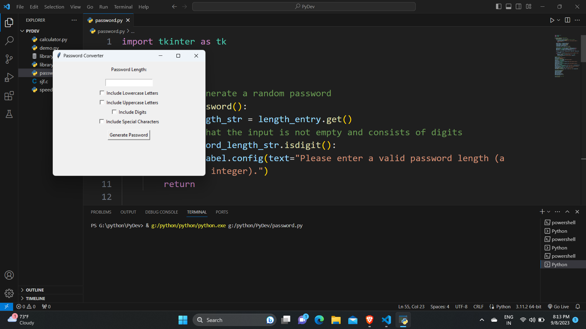

# **Project 1: Random Password Generator with Tkinter GUI in Python**

**Internship Project at CodeClause**

A Python project that generates secure random passwords with a user-friendly Tkinter GUI. This project is part of my Python development internship at CodeClause.

## Features

- User-friendly GUI.
- Customize password length and complexity.
- Generate strong, random passwords.

## Screenshots

## Demo Video

[Watch on YouTube](https://youtu.be/KIyL64pVhgA)

## Usage

1. Clone the repository.
2. Run `python password_generator.py`.
3. Use the GUI to generate passwords.

## Dependencies

- Python
- Tkinter

## License

This project is licensed under the MIT License - see the [LICENSE](LICENSE) file for details.
